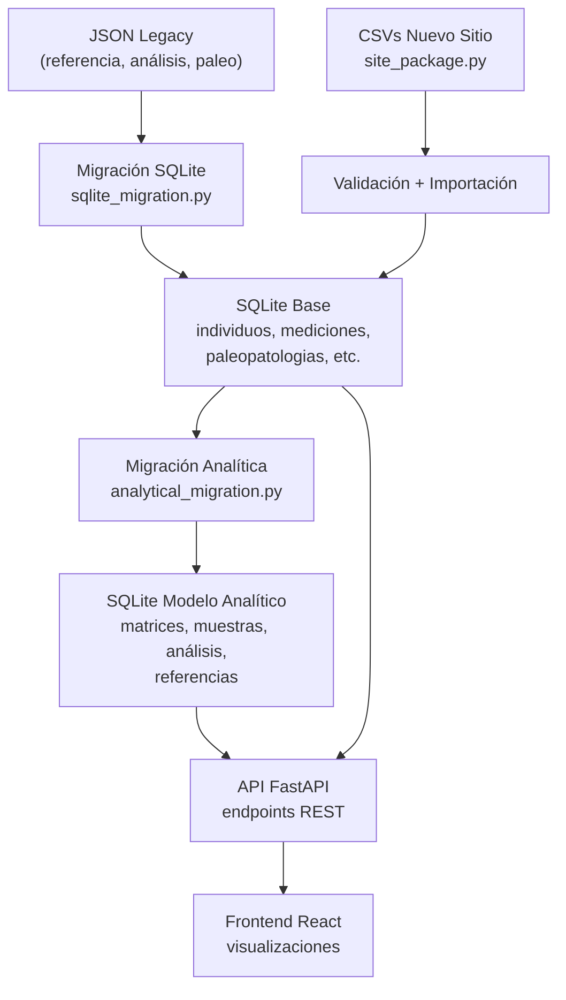

# Documentación Interna de ArqueoGraph
## 1. Visión general
ArqueoGraph ha migrado su capa de datos desde archivos JSON (legacy) a una base de datos SQLite normalizada. Esta decisión permite:
* Consultas más rápidas y flexibles.
* Integridad referencial mediante claves foráneas.
* Escalabilidad para nuevos sitios.
* Un modelo analítico estructurado (matrices, muestras, análisis, referencias) que facilita la trazabilidad de los datos químicos.

La aplicación se compone de:
* Backend (FastAPI): expone una API REST que lee y escribe en SQLite.
* Frontend (React + Vite): consume la API y presenta las visualizaciones.
* Scripts de administración: para migrar datos legacy, importar CSVs y gestionar sitios.

## 2. Estructura de la base de datos SQLite
El esquema se define en **backend/app/database.py** y consta de las siguientes tablas principales:
### 2.1. Tablas maestras
| Tabla  | Descripción |
| ------------- |:-------------:|
|sitios|Sitios arqueológicos (id_sitio, nombre, coordenadas, view).|
|individuos|Individuos/entierros (id_individuo, sexo, edad, fuente, etc.).|
|mediciones_quimicas|Mediciones de elementos (elemento, concentración, unidad, id_individuo).|
|paleopatologias|Patologías (patologia, presente, valor, id_individuo).|
|dataciones|Dataciones radiocarbónicas (fecha_bp, rango, id_individuo).|
|imagenes|Imágenes asociadas a individuos (ruta, metadatos).|

### 2.2. Modelo analítico (tablas de normalización)
Estas tablas permiten asociar cada medición a una muestra, un análisis y una referencia bibliográfica, garantizando la trazabilidad.
| Tabla  | Descripción |
| ------------- |:-------------:|
| matrices |Tipos de muestra (ej. cabello, costilla) con código y categoría.|
| matrices_aliases |Sinónimos para normalizar nombres de matrices.|
| muestras |Muestras físicas (id_muestra, id_individuo, id_matriz, código).|	
| referencias_analiticas |Referencias bibliográficas o metodológicas (título, cita, DOI, laboratorio, método).|	
| analisis_quimicos |Análisis químicos (id_analisis, id_muestra, id_referencia, dataset_origen, método).|	
| mediciones_quimicas |Columna id_analisis para enlazar con análisis.|	

#### Relaciones clave:
```txt
individuos 1---N muestras 1---N analisis_quimicos 1---N mediciones_quimicas
matrices 1---N muestras
referencias_analiticas 1---N analisis_quimicos
```
Esto permite saber exactamente de qué muestra, con qué método y referenciado por qué fuente proviene cada medición.

### 2.3. Índices y restricciones
* Claves primarias en todas las tablas.
* Claves foráneas con *ON DELETE CASCADE* para mantener integridad.
* Índices en columnas frecuentemente consultadas *(fuente, elemento, id_individuo)*.

## 3. Migración de datos legacy (JSON → SQLite)
### 3.1. Migración inicial
* Script: *backend/app/sqlite_migration.py*
* Función: **migrate_json_sources_to_sqlite()**
* Origen: Archivos JSON definidos en **config.py** *(referencias, análisis, paleopatologías, imágenes)*.
* Proceso:
  1. Lee cada JSON y extrae casos.
  2. Inserta o actualiza registros en *sitios, individuos, mediciones_quimicas, paleopatologias, dataciones e imagenes.*
  3. Se ejecuta automáticamente al iniciar la API si la tabla *sitios* está vacía **(ensure_sqlite_sources)**.

### 3.2. Migración del modelo analítico
* Script: *backend/app/analytical_migration.py*
* Función: **migrate_analytical_model()**
* Objetivo: Agrupar mediciones en muestras inferidas y análisis, asignando matrices y referencias.
* Lógica:
  * Identifica matrices únicas por *tipo_muestra*.
  * Crea una *muestra* por cada combinación de *id_individuo + id_matriz*.
  * Agrupa mediciones por *dataset_origen* y metadatos (laboratorio, método) para crear *analisis_quimicos*.
  * Vincula cada medición a un *id_analisis*.

* Ejecución: Se dispara en el startup *ensure_analytical_model()* si hay mediciones sin análisis.

## 4. Proceso de importación de nuevos sitios (CSV)
El sistema permite agregar nuevos sitios mediante **paquetes CSV normalizados**. La herramienta principal es *backend/scripts/site_package.py*.

### 4.1. Estructura del paquete CSV
Cada sitio requiere 6 archivos CSV (pueden estar vacíos para las tablas opcionales):
| Archivo  | Columnas obligatorias |
| ------------- |:-------------:|
|sitios.csv|id_sitio, nombre|
|individuos.csv|id_individuo, id_documento|
|mediciones_quimicas.csv|id_medicion, id_individuo, elemento, concentracion|
|paleopatologias.csv|id_paleopatologia, id_individuo, patologia|
|dataciones.csv|id_datacion, id_individuo|
|imagenes.csv|id_imagen, id_individuo, relative_path|

**Regla**: El valor de fuente en todas las tablas (excepto sitios) debe ser igual al **id_sitio**.

### 4.2. Comandos disponibles
```bash
# Crear paquete vacío
python backend/scripts/site_package.py create --id nuevo_sitio --nombre "Nuevo Sitio" --overwrite

# Clonar desde un sitio existente (para pruebas)
python backend/scripts/site_package.py create --id prueba --nombre "Prueba" --clone-from morro1 --prefix PRUEBA --overwrite

# Validar columnas, IDs y relaciones
python backend/scripts/site_package.py validate --id nuevo_sitio

# Importar a SQLite (--replace para sobrescribir datos del mismo sitio)
python backend/scripts/site_package.py import --id nuevo_sitio --replace

# Ver conteos en la base de datos
python backend/scripts/site_package.py status --id nuevo_sitio
```
### 4.3. Orden de importación
El script importa en el orden correcto para respetar las claves foráneas:
1. sitios
2. individuos
3. mediciones_quimicas
4. paleopatologias
5. dataciones
6. imagenes

## 5. API y consumo desde el frontend
El backend expone endpoints REST bajo ```http://127.0.0.1:8000 (o 8001)```. El frontend utiliza la biblioteca *api.js* para comunicarse.

### 5.1. Endpoints principales
| Método  | Endpoint | Descripción |
| ------------- |:-------------:|:-------------:|
|GET|```/dashboard/overview```|Datos agregados para el panel principal (sitios, conteos, distribuciones).|
|GET|```/filters/options```|Opciones de filtros (sexos, edades, elementos, patologías) para un sitio.|
|GET|```/graph/site/{fuente}/reference```|Grafo de referencia de un sitio (nodo central + individuos)|
|GET|```/graph/site/{fuente}/elemento/{elemento}```|Grafo de un elemento químico.|
|GET|```/graph/site/{fuente}/patologia/{patologia}```|Grafo de una patología.|
|GET|```/analysis/site/{fuente}/pca```|Cálculo de PCA para un conjunto de elementos.|
|GET|```/graph/site/{fuente}/table```|Tabla de mediciones filtrada (para exportar).|
|POST|```/admin/import/sitios/csv```|Importa CSVs de sitios.|
|POST|```/admin/backup```|Genera respaldo de la base SQLite.|

Todos los endpoints aceptan parámetros de filtro como sexo, edad, matriz, referencia, elemento, patologia.

### 5.2. Flujo típico del frontend
1. Carga inicial: *App.jsx* obtiene la lista de sitios desde ```/dashboard/overview``` y la muestra en el header.

2. Selección de sitio: Al hacer clic en un sitio, se monta *SiteExplorerPage* con el *fuente* correspondiente.

3. Carga de contexto: *SiteExplorerPage* llama a ```/analysis/site/{fuente}/context``` para obtener matrices, referencias y elementos disponibles.

4. Actualización de filtros: Cuando el usuario cambia sexo, edad, etc., se dispara una nueva llamada a ```/graph/site/{fuente}/...``` con esos parámetros.

5. Visualización de gráficos: Los datos se renderizan en componentes como *NetworkGraph, BarChart, PCAPlot*.

6. Detalle de caso: Al hacer clic en un nodo, se solicita ```/graph/site/{fuente}/case/{case_id}/relation``` para obtener imágenes, patologías y mediciones asociadas.

### 5.3. Manejo de imágenes
* Las imágenes se almacenan en backend/data/imagenes/ y se sirven estáticamente desde /files/imagenes/.
* El frontend usa la función absoluteImageUrl() para construir la URL completa.
* La tabla imagenes registra la ruta relativa y metadatos.

## 6. Modelo analítico en la práctica
### 6.1. ¿Por qué es importante?
* Permite distinguir mediciones hechas sobre diferentes tipos de muestra (ej. cabello vs. costilla), evitando promediar elementos que no son comparables.
* Asocia cada medición a un método y laboratorio, facilitando la reproducibilidad.
* Vincula los datos a referencias bibliográficas, dando contexto científico.

### 6.2. ¿Cómo se construye?
Durante la migración *(analytical_migration.py)*:

* Se identifican matrices únicas (ej. "costilla" → se normaliza a "costilla" con su categoría "Tejido óseo").
* Se crean *muestras* inferidas para cada individuo y matriz.
* Se agrupan mediciones por *dataset_origen* y metadatos (laboratorio, método, fecha) para crear *analisis_quimicos*.
* Cada medición se enlaza a su análisis.

### 6.3. Consultas típicas
* Obtener todas las muestras de un sitio: ```GET /analysis/site/{fuente}/samples```.
* Obtener contexto analítico (matrices, referencias): ```GET /analysis/site/{fuente}/context```.
* Calcular PCA solo con mediciones de una misma matriz y referencia (evita mezclar escalas).

## 7. Respaldo y mantenimiento
* Respaldos: El endpoint ```POST /admin/backup``` genera un archivo *.sqlite* con toda la base de datos en **data/respaldo_*.sqlite**.
* Reset: POST /admin/reset-db elimina todas las tablas y reinicia la base (cuidado con datos).
* Sincronización de imágenes: ```POST /admin/imagenes/sync``` escanea carpetas en *data/imagenes/* y registra imágenes huérfanas.

## 8. Convenciones de IDs
* **id_sitio**: minúsculas, guiones bajos, sin espacios (ej. morro1, azapa, nuevo_sitio).
* **id_individuo**: prefijo del sitio + identificador (ej. morro1_T1C1).
* **id_medicion**: combinación de id_individuo + elemento + tipo_muestra (ej. morro1_T1C1_Mn_costilla).
* **id_paleopatologia**: id_individuo + patología (ej. morro1_T1C1_periostitis).

## 9. Diagrama de flujo de datos (resumen)


## 10. Preguntas frecuentes (FAQ)
**¿Puedo agregar un sitio sin imágenes?**
Sí, solo hay que dejar *imagenes.csv* con el encabezado (sin filas). El script valida que el archivo exista, pero permite filas vacías.

**¿Qué pasa si un id_individuo ya existe?**
La importación con *--replace* elimina primero todos los datos del sitio y luego los reinserta. Si no usas *--replace*, los *INSERT* con *ON CONFLICT* actualizan los registros existentes (sin duplicar).

**¿Cómo se manejan las unidades de medición?**
Se recomienda usar *ppm* para todos los elementos, pero el campo unidad es libre. El sistema no convierte automáticamente; los usuarios deben asegurar la consistencia.

**¿Cómo sé si el modelo analítico está completo?**
El endpoint ```/admin/analytical-model/audit``` devuelve estadísticas: cantidad de mediciones sin análisis, conflictos de unidades por muestra, etc.